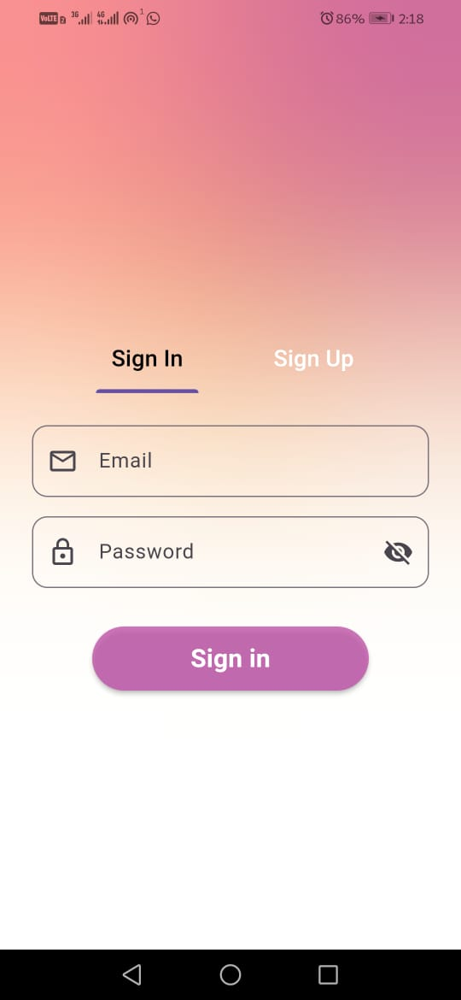
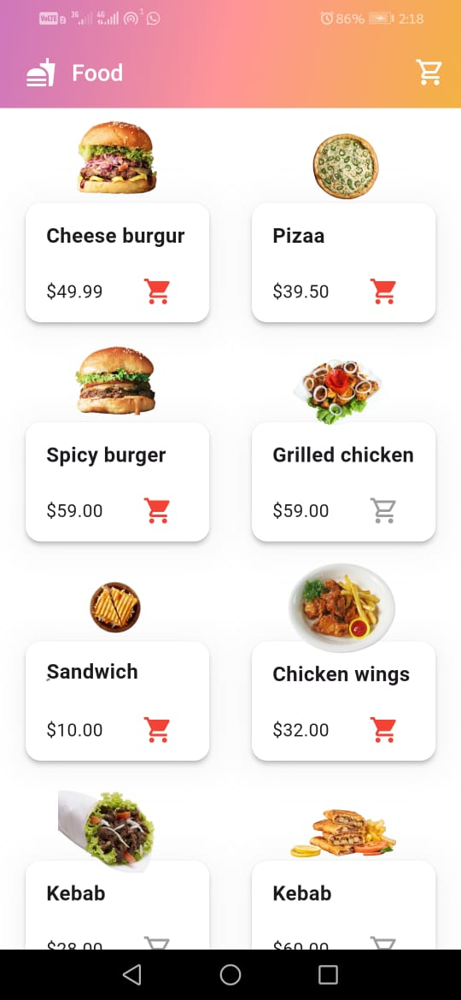
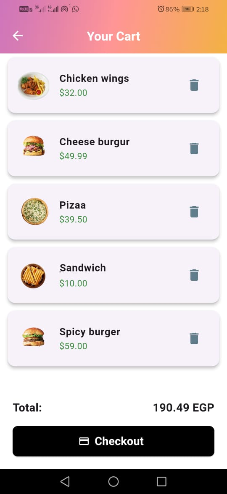
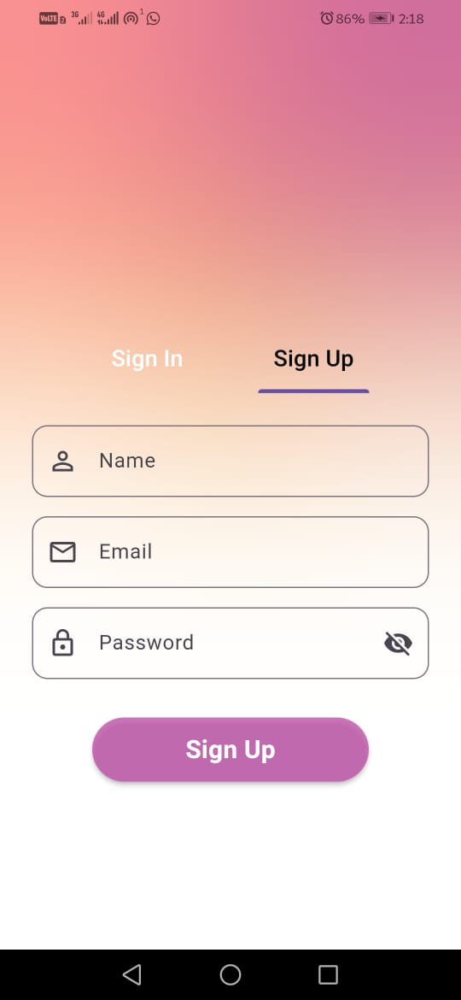

# 🍽️ Task App - Basic Restaurant Mobile App

This is a simple restaurant Flutter mobile app built . It includes Firebase Authentication and displays a food menu with an add-to-cart feature using local state management.

## 🚀 Features

### 🔐 Authentication
- Login with email and password
- Firebase Authentication
- Form validation (empty fields, invalid email)

### 📋 Menu Page
- List of static food items
- Each item displays:
  - Name
  - Price
  - Image
- Clean UI layout

### 🛒 Add to Cart
- Add/remove items from local cart
- Cart page displays:
  - Selected items
  - Total price
- Managed with `setState` 

## 🧩 Tech Stack
- Flutter
- Firebase Authentication
- Local state management (`setState`)
- Clean folder structure: `screens`, `widgets`, `models`,  etc.

## 🎨 UI Preview

| Login Page | Menu Page | Cart Page |
|------------|-----------|-----------|
|  |  |  | 
